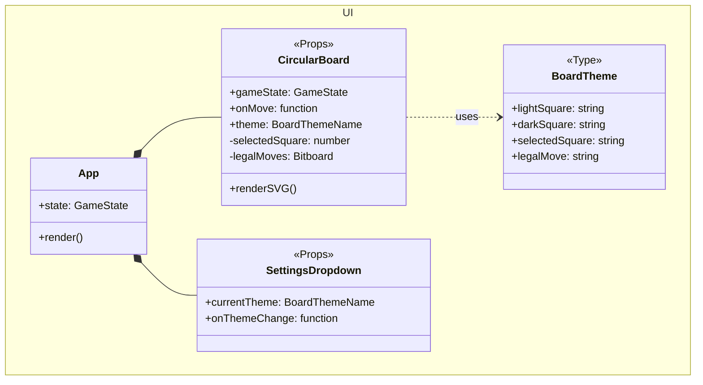

```mermaid
classDiagram
    namespace UI {
        class App {
            +state: GameState
            +render()
        }

        class CircularBoard {
            <<Props>>
            +gameState: GameState
            +onMove: function
            +theme: BoardThemeName
            
            <<State>>
            -selectedSquare: number
            -legalMoves: Bitboard
            
            +renderSVG()
        }

        class SettingsDropdown {
            <<Props>>
            +currentTheme: BoardThemeName
            +onThemeChange: function
        }
        
        class BoardTheme {
            <<Type>>
            +lightSquare: string
            +darkSquare: string
            +selectedSquare: string
            +legalMove: string
        }
    }

    App *-- CircularBoard
    App *-- SettingsDropdown
    CircularBoard ..> BoardTheme : uses
```
