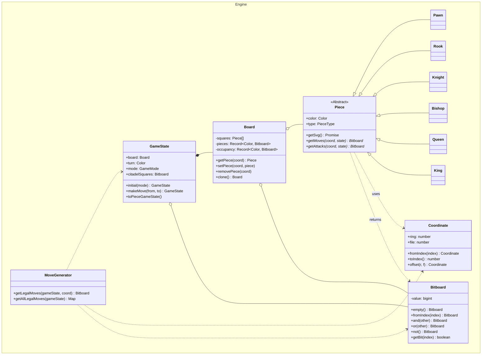

```mermaid
classDiagram
    namespace Engine {
        class GameState {
            +board: Board
            +turn: Color
            +mode: GameMode
            +citadelSquares: Bitboard
            +initial(mode) GameState
            +makeMove(from, to) GameState
            +toPieceGameState()
        }

        class Board {
            -squares: Piece[]
            -pieces: Record~Color, Bitboard~
            -occupancy: Record~Color, Bitboard~
            +getPiece(coord) Piece
            +setPiece(coord, piece)
            +removePiece(coord)
            +clone() Board
        }

        class Bitboard {
            -value: bigint
            +empty() Bitboard
            +fromIndex(index) Bitboard
            +and(other) Bitboard
            +or(other) Bitboard
            +not() Bitboard
            +getBit(index) boolean
        }

        class Coordinate {
            +ring: number
            +file: number
            +fromIndex(index) Coordinate
            +toIndex() number
            +offset(r, f) Coordinate
        }

        class MoveGenerator {
            +getLegalMoves(gameState, coord) Bitboard
            +getAllLegalMoves(gameState) Map
        }

        class Piece {
            <<Abstract>>
            +color: Color
            +type: PieceType
            +getSvg() Promise
            +getMoves(coord, state)* Bitboard
            +getAttacks(coord, state)* Bitboard
        }

        class Pawn
        class Rook
        class Knight
        class Bishop
        class Queen
        class King
    }

    GameState *-- Board
    GameState o-- Bitboard
    Board o-- Piece
    Board o-- Bitboard
    
    MoveGenerator ..> GameState
    MoveGenerator ..> Coordinate
    MoveGenerator ..> Bitboard

    Piece <|-- Pawn
    Piece <|-- Rook
    Piece <|-- Knight
    Piece <|-- Bishop
    Piece <|-- Queen
    Piece <|-- King
    
    Piece ..> Coordinate : uses
    Piece ..> Bitboard : returns
```
