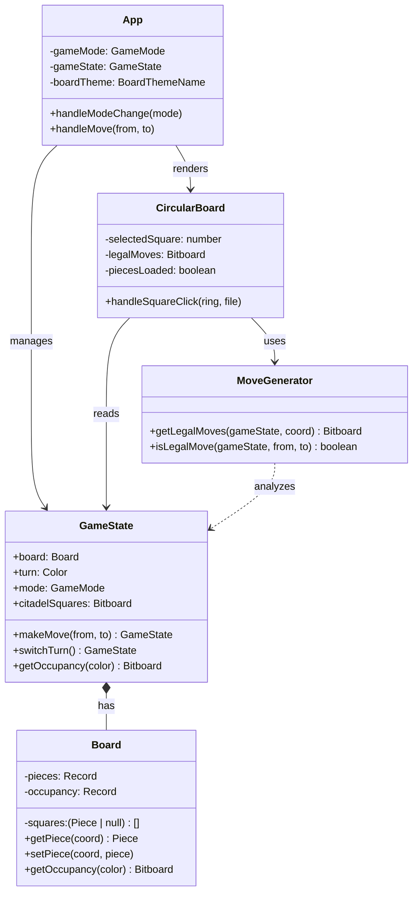

```mermaid
classDiagram
    class App {
        -gameMode: GameMode
        -gameState: GameState
        -boardTheme: BoardThemeName
        +handleModeChange(mode)
        +handleMove(from, to)
    }

    class CircularBoard {
        -selectedSquare: number
        -legalMoves: Bitboard
        -piecesLoaded: boolean
        +handleSquareClick(ring, file)
    }

    class GameState {
        +board: Board
        +turn: Color
        +mode: GameMode
        +citadelSquares: Bitboard
        +makeMove(from, to) GameState
        +switchTurn() GameState
        +getOccupancy(color) Bitboard
    }

    class Board {
        -squares: (Piece | null)[]
        -pieces: Record
        -occupancy: Record
        +getPiece(coord) Piece
        +setPiece(coord, piece)
        +getOccupancy(color) Bitboard
    }

    class MoveGenerator {
        +getLegalMoves(gameState, coord) Bitboard
        +isLegalMove(gameState, from, to) boolean
    }

    App --> GameState : manages
    App --> CircularBoard : renders
    CircularBoard --> GameState : reads
    CircularBoard --> MoveGenerator : uses
    GameState *-- Board : has
    MoveGenerator ..> GameState : analyzes
```
